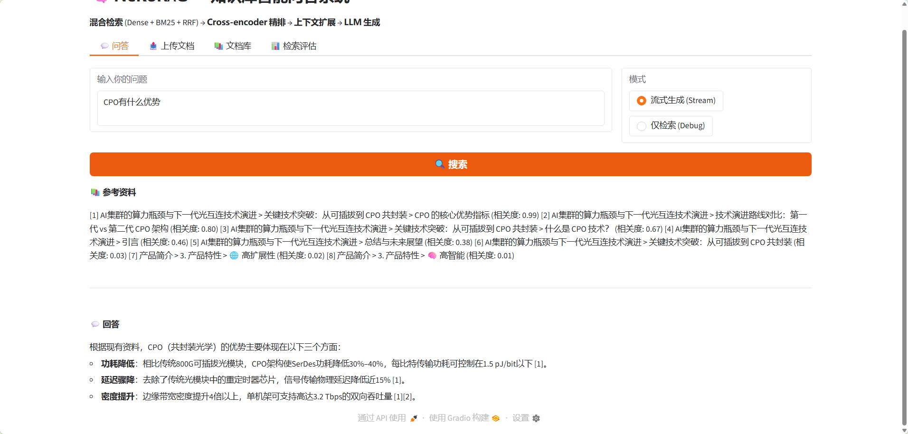
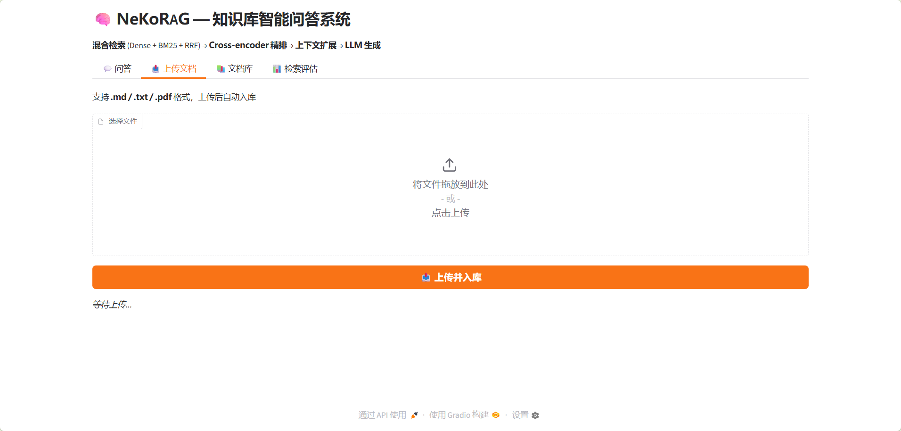

# 🧠 NeKoRAG — 企业级 RAG 知识库问答系统

<p align="center">
  
  
  
  
  
</p>

**混合检索 + Cross-encoder 精排 + 链表上下文扩展** 的 RAG 后台服务，为下游 Agent / Chatbot 提供知识库检索与生成 API。

---

## 📸 界面预览

| 💬 流式问答 | 📤 文档上传 |
|------------|------------|
|  |  |

---

## 🏗️ 检索流水线

```
用户 Query
  │
  ├─ 稠密检索 (ChromaDB + bge-m3)  ─┐
  ├─ 稀疏检索 (BM25 + jieba)         ─┤  RRF 融合  ─→  Top-N 候选
  └───────────────────────────────────┘
                  │
                  ▼
         Cross-encoder 精排 (BGE-reranker-v2-m3)
                  │
                  ▼
         expand_context (沿链表指针拉取相邻 chunk)
                  │
                  ▼
         LLM 流式生成 (DeepSeek, SSE)
```

### 核心设计理念

两路检索天然互补：向量检索擅长语义相近但用词不同的内容，BM25 检索擅长精确关键词（产品编号、技术缩写）匹配。

RRF (Reciprocal Rank Fusion) 融合只关心排名而非原始分数，不需要调权重，对分数分布鲁棒（k=60）。

---

## 📊 检索评估

基于 **12 个测试查询**（精确关键词 / 语义匹配 / 混合场景三类）的对比评估：

| 策略 | MRR | Hit@1 | NDCG@5 |
|------|:---:|:-----:|:------:|
| 纯 Dense (Chroma) | 0.903 | 83.3% | 0.842 |
| 纯 BM25 (jieba) | 0.840 | 75.0% | 0.702 |
| 混合 Dense+BM25+RRF | 0.917 | 83.3% | 0.793 |
| **混合 + Reranker 精排** | **0.933** | **91.7%** | **0.851** |

**分场景 MRR：**

| 场景 | 纯 Dense | 纯 BM25 | 混合+RRF | 混合+Reranker |
|------|----------|---------|----------|---------------|
| 🔑 精确关键词 | 0.833 | **0.875** | 0.875 | **1.000** |
| 🧠 语义匹配 | **0.875** | 0.646 | **0.875** | 0.800 |
| 🎯 混合场景 | 1.000 | 1.000 | 1.000 | 1.000 |

> 💡 **关键结论**：BM25 在精确术语查询上反超 Dense（0.875 vs 0.833），验证了双路互补架构的必要性；Reranker 将整体 MRR 从 0.903 提升至 0.933（+3.3%），Hit@1 从 83.3% 提升到 91.7%（+8.4pp）。

---

## 🧩 技术栈

| 模块 | 技术选型 | 说明 |
|------|---------|------|
| Web 框架 | FastAPI + Uvicorn | 异步高性能，CORS 开放 |
| 向量存储 | ChromaDB | 本地持久化，零配置 |
| Embedding | Ollama + bge-m3 | 1024 维，中英文语义向量 |
| 关键词检索 | BM25 + jieba | 中文分词，索引 pickle 持久化 |
| 混合融合 | RRF (k=60) | 多路召回排名融合 |
| 精排 | Jina Reranker API | Cross-encoder，云端精排 |
| LLM 生成 | DeepSeek API | 兼容 OpenAI 接口，SSE 流式 |
| 文档解析 | pdfplumber + PyMuPDF + OCR | 三层回退，表格 → Markdown |
| 前端 | Gradio 6 | 一键启动，问答/上传/文档管理 |
| 部署 | Docker + docker-compose | 健康检查，双模式（宿主机/WSL） |

---

## 📁 项目结构

```
NeKoRAG/
├── api/                     # FastAPI 应用
│   ├── __init__.py          # app 定义 + CORS
│   ├── documents.py         # 文档管理端点
│   ├── query.py             # 检索问答端点（含 SSE）
│   └── schemas.py           # Pydantic 模型
├── generation/              # LLM 生成
│   └── generator.py         # DeepSeek 同步 + 流式
├── ingest/                  # 文档入库
│   ├── loader.py            # 多策略 PDF/MD/TXT 加载
│   ├── chunker.py           # Markdown 层级感知切片 + 链表指针
│   └── pipeline.py          # 全量/增量入库管线
├── retrieval/               # 检索核心
│   ├── embeddings.py        # Ollama embedding（重试/超时/批处理）
│   ├── bm25.py              # BM25 索引 + 持久化
│   ├── hybrid.py            # RRF 混合检索
│   ├── reranker.py          # Cross-encoder 精排 + 上下文扩展
│   └── vector_store.py      # ChromaDB 批量写入
├── schema/                  # 数据模型
│   └── chunk_schema.py      # DocumentChunk + ChunkMetadata
├── frontend/                # Gradio 前端
│   └── app.py               # 交互界面（问答/上传/文档库/评估）
├── evaluation/              # 评估
│   ├── eval.py              # 检索质量评估（MRR/Hit Rate/NDCG）
│   └── test_pdfs.py         # PDF 解析测试集生成与验证
├── documents/               # 设计文档
│   ├── hybrid-retrieval-design.md
│   └── pdf-parsing-design.md
├── data/                    # 持久化数据
│   ├── uploads/             # 上传文件 + .meta.json sidecar
│   ├── chroma_db/           # ChromaDB 向量库
│   ├── bm25_index/          # BM25 索引
│   ├── test_pdfs/           # PDF 解析测试集
│   └── eval_report.json     # 评估报告
├── image/                   # 截图
│   ├── ask.png
│   └── upload.png
├── main.py                  # CLI 测试入口
├── Dockerfile
├── docker-compose.yml
└── pyproject.toml
```

---

## 🚀 快速开始

### 前置条件

```bash
# 1. 安装 Ollama 并拉取 embedding 模型
ollama pull bge-m3:latest

# 2. 安装项目依赖
uv sync
```

### 配置环境变量

```bash
cp .env.example .env
# 编辑 .env 填入 API Key
```

| 变量 | 说明 |
|------|------|
| `EMBEDDING_BASE_URL` | Ollama 地址（默认 `http://localhost:11434`） |
| `EMBEDDING_MODEL` | Embedding 模型（默认 `bge-m3:latest`） |
| `CHAT_BASE_URL` | LLM API 地址（DeepSeek 或其他 OpenAI 兼容） |
| `CHAT_MODEL` | 生成模型（如 `deepseek-v4-flash`） |
| `CHAT_MODEL_APIKEY` | LLM API Key |
| `SILICONFLOW_RERANKER_MODEL_API_KEY` | 硅基流动 Reranker API Key |
| `PDF_PARSE_STRATEGY` | PDF 解析策略：`auto` / `pdfplumber` / `pymupdf` / `ocr` |

### 启动

```bash
# 终端1: 后端 API
PYTHONPATH=. uv run uvicorn api:app --host 0.0.0.0 --port 8000 --reload

# 终端2: 前端（可选）
PYTHONPATH=. uv run python3 frontend/app.py
# → 浏览器打开 http://localhost:7860
```

### Docker 部署

```bash
docker compose up -d
# API: http://localhost:8000
# 健康检查: http://localhost:8000/health
```

---

## 🔌 API 端点

### 文档管理

| 方法 | 端点 | 说明 |
|------|------|------|
| POST | `/v1/documents/upload` | 上传文档（.md/.txt/.pdf），自动入库 |
| GET | `/v1/documents` | 列出已入库文档及切片数 |
| DELETE | `/v1/documents/by-id?doc_id=xxx` | 删除文档及全部切片 |
| GET | `/v1/documents/by-id/status?doc_id=xxx` | 查询文档处理状态 |
| POST | `/v1/documents/reset` | 清空所有索引并全量重建 |

### 检索问答

| 方法 | 端点 | 说明 |
|------|------|------|
| POST | `/v1/query/generate` | 检索 + LLM 生成回答 |
| POST | `/v1/query/stream` | SSE 流式生成 |
| POST | `/v1/query/retrieval-only` | 仅检索（调试用） |

### 健康检查

| 方法 | 端点 | 说明 |
|------|------|------|
| GET | `/health` | 服务状态 |

### 使用示例

```bash
# 上传文档
curl -X POST http://localhost:8000/v1/documents/upload \
  -F "file=@docs/report.pdf"

# 流式问答
curl -N -X POST http://localhost:8000/v1/query/stream \
  -H "Content-Type: application/json" \
  -d '{"query": "CPO 共封装光学技术有哪些优势？"}'

# 检索评估
PYTHONPATH=. uv run python3 evaluation/eval.py
```

---

## 📐 PDF 解析策略

NeKoRAG 采用 **三层回退架构** 处理真实世界的多样性 PDF：

```
pdfplumber（默认，表格 → Markdown）
    │
    ├── 质量不足 (< 50 字符/页)
    │
    ▼
PyMuPDF（纯文本，速度快 3-5x）
    │
    ├── 质量不足
    │
    ▼
Tesseract OCR（扫描件兜底，需系统安装 tesseract）
```

通过 `PDF_PARSE_STRATEGY` 环境变量可强制指定策略。详见 [设计文档](documents/pdf-parsing-design.md)。

---

## 🧪 评估与测试

```bash
# 检索质量评估（MRR / Hit Rate / NDCG）
PYTHONPATH=. uv run python3 evaluation/eval.py

# PDF 解析器测试
PYTHONPATH=. uv run python3 evaluation/test_pdfs.py
```

评估报告自动导出至 `data/eval_report.json`。

---

## 📖 设计文档

- [混合检索设计](documents/hybrid-retrieval-design.md) — 为什么需要双路召回 + RRF 融合
- [PDF 解析设计](documents/pdf-parsing-design.md) — 三引擎回退 + 表格转 Markdown

---

## 🤝 与 Agent 框架联动

NeKoRAG 提供知识检索能力，可被 Agent 框架通过 HTTP API 直接调用：

```python
# Cocon / LangChain Agent 中作为 Tool 使用
async def rag_search(query: str) -> dict:
    async with httpx.AsyncClient() as client:
        resp = await client.post(
            "http://localhost:8000/v1/query/retrieval-only",
            json={"query": query}
        )
    return resp.json()
```

---

<p align="center">
  <sub>Built with Python · FastAPI · ChromaDB · LangChain · BM25 · DeepSeek · Gradio</sub>
</p>
